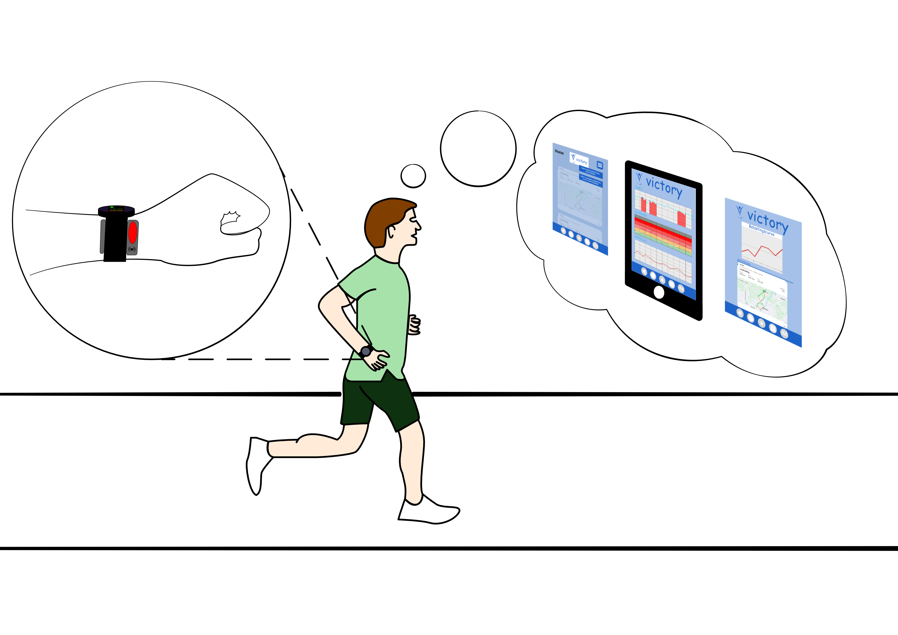
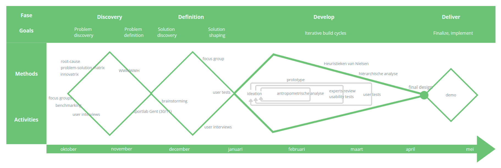
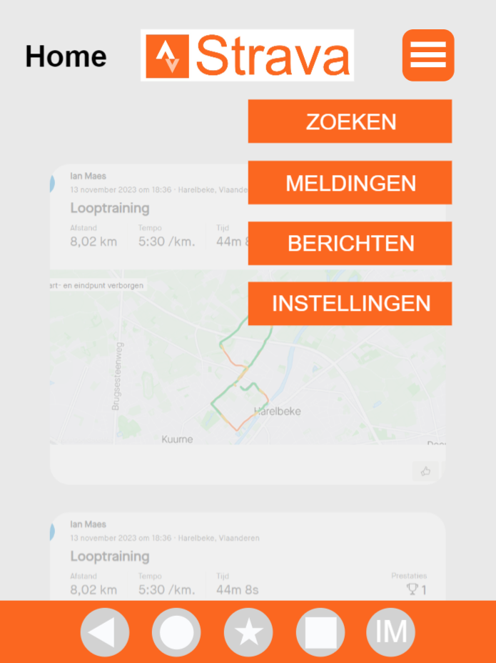
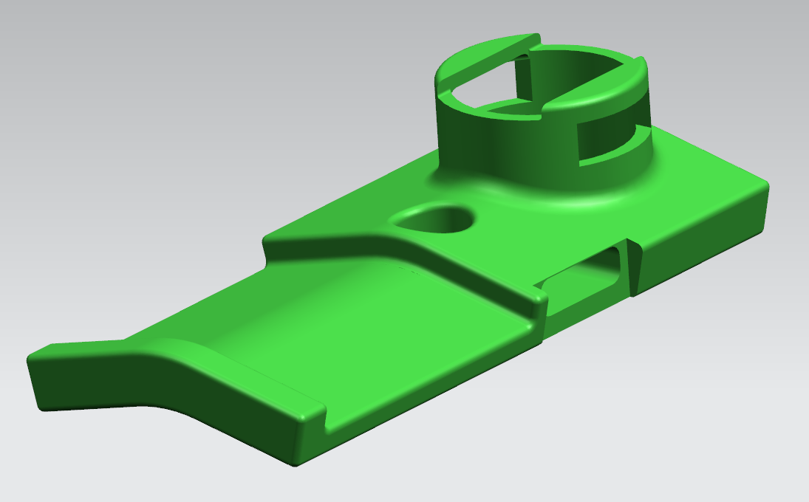

# Victory
*Blessures bij lopers reduceren door middel van schokdetectie, die via een led en trilling wordt waargenomen.* 

*Ian Maes*

24/05/2024

## Samenvatting
Heden ondervinden talrijke hardlopers belemmeringen in de vorm van **blessures**. Middels schokdetectie zal een waarschuwing aan de hardlopers worden verstrekt, waardoor zij gedurende de loopactiviteit de loopstijl kunnen moduleren ter voorkoming van blessures. Het is echter cruciaal om de lopers **tijdens het hardlopen effectief te waarschuwen**. In een initiële poging hiertoe werd gebruik gemaakt van auditieve interferentie, zoals ruis op muziek. Uit een aanvankelijk onderzoek bleek dat niet iedereen de voorkeur geeft aan hardlopen met muzikale begeleiding. Om die reden werd naar alternatieve benaderingen gezocht. Het doel is om de hardlopers te waarschuwen door middel van een **led die de kleur rood aanneemt**. Deze waarschuwingsfunctie kan worden geïntegreerd als een toevoeging aan het horloge. Gezien het feit dat de overgrote meerderheid van hardlopers reeds een horloge draagt, is het gerbuik hiervan relatief eenvoudig.

Bovendien kan er een **disciplinaire sanctie** geassocieerd worden met deze waarschuwing, zodat hardlopers niet slechts worden geïnformeerd over hetsuboptimale loopgedrag, maar ook extra gemotiveerd worden om daadwerkelijk corrigerende acties te ondernemen. Deze disciplinaire maatregel neemt de vorm aan van een **vermindering van de loopsnelheid**, iets wat iedere hardloper vanzelfsprekend wenst te vermijden, aangezien niemand graag heeft dat de afnemende snelheid wordt waargenomen door vrienden of medelopers.

Tot slot is het van belang dat deze data tot bij de gebruikers geraakt. Hiervoor wordt gebruik gemaakt van een **applicatie**. Deze app geeft de data op een overzichtelijke manier weer. Zo kan de loper duidelijk zien waar er ruimte is voor verbetering. Met hulp van deze applicatie zal ook het sociale contact met vrienden bevorderd worden.



## Introductie
Victoris[^1] heeft lang onderzoek gedaan naar dit onderwerp en bedacht het idee om met een sensorband signalen te sturen naar een koptelefoon die de loper waarschuwt. Uiteindelijk was het concept niet overtuigend genoeg. Daarom heeft het initiële concept een paar aanpassingen/toevoegingen nodig. Gedurende lange tijd vormde het obstakel zich in het onvermogen van technologie om hardlopers van blessures te ontnemen. Victoris heeft getracht deze situatie te verbeteren. De technologie voor schokdetectie tijdens het hardlopen is geëvalueerd en heeft zich als uitermate doeltreffend bewezen. Echter, er bestaat een wens om aanvullende inzichten te vergaren met betrekking tot het waarschuwen van hardlopers en mogelijke aanpassingen aan de sensorband. 
De ambitie is om het product succesvol op de markt te introduceren. 

Randvoorwaarden:
- gebruiksvriendelijkheid
- aanpasbaarheid
- visualisatie

## Methodologie
Het eerste deel van de opdracht werd opgedeeld in 2 grote fasen: discovery en definition. Dit is hieronder weergegeven in een quadruple diamond.



### problem discovery 
In het eerste deel ging alle aandacht naar het onderzoeken van de opdracht. Dit alles om de verschillende deelaspecten van de opdrachten in kaart te brengen. 
Dit werd met volgende methodes aangepakt: 
- Innovatrix
- WWWWWH-model
- Problem Solution Matrix
- Root-cause analysis
### problem definition
Na het bespreken van alle problemen was er terug nood aan eenduidigheid. Aan de hand van *user interviews* werd geconvergeerd naar het idee om het auditieve interferentie aan te pakken. Ook het sociale contact zal geïntroduceerd worden.

### solution discovery
In de tweede fase werd opnieuw gedivergeerd met ideation en werd het sportlab in Gent bezocht. Dit was een heel interessant bezoek, aangezien er veel feedback en feedforward werd gegeven door experten. Ze waren enthousiast over het idee om te werken met leds. Daarna moesten ideeën gegenereerd worden. Het prototypen kon beginnen.

### solution shaping
Daarna moest opnieuw een keuze gemaakt worden tussen verschillende prototypes. Voor dit te verwezenlijken werden gerbuikerstesten gehouden. Via deze methode werden snelle en correcte beslissingen genomen. 

### iterative build cycles (ideate - prototype - test)
In deze fase werd 3 maal de cyclus 'ideate - prototype - test' doorlopen. Telkens uit een andere invalshoek: *Human Body*, *Human Mind* en *Human Senses*. Telkens na een cyclus werden design requirements opgesteld. Op die manier werd duidelijk wat er in het concept nodig was en wat niet.
### finalize, implement
...

## Discovery
### Doelstellingen
Het doel is om een duidelijk inzicht te krijgen in welke deelaspecten geïnoveerd moeten worden en hoe dit verwezenlijk kan worden.
### Materiaal & methoden
De volledige ruimte werd eerst onderzocht aan de hand van:
- Benchmarking
- Sportlab Gent
- User interviews

### Resultaten
#### Benchmarking (N=8)
Aangezien vele designkeuzes vaak al succesvol opgelost worden door anderen, werd gebruik gemaakt van benchmarking. Niet alles moet opnieuw onderzocht worden. Daarom worden bestaande oplossing grondig bestudeerd. Alle resultaten werden gestructureerd in een *problem-solution matrix* gegoten.


#### Sportlab Gent (30/11)
Dit werd zoals vermeld eigenlijk later pas gedaan, maar wat hieronder vermeld wordt past beter bij de *discovery* fase. Een inzicht dat daar gegeven werd, was dat ook de iets minder gedreven lopers zich moeten aangesproken voelen. Het zijn dan namelijk ook vaak deze lopers die te kampen krijgen met blessures [^2]. Ook sinds Corona zijn er veel mensen die ineens beginnen sporten. Deze groep is uiteraard niet zo fysiek in orde zoals echt sporters. Daarom moet zeker bekeken worden hoe deze groep kan aangezet worden tot het kopen van het product.

#### User interviews (N=4)
Om de probleemruimte grondig te analyseren kon een user interview uiteraard niet ontbreken. Op die manier wordt met de toekomstige gebruikers kort op de bal gespeeld. Vaak worden hier ook nieuwe inzichten gegeven of worden vermoedens bevestigd. Na de korte ondervraging werd snel duidelijk dat doorgaan met het audio-systeem niet zou werken.
> "In wedstrijden loop ik nooit met muziek."

Ook het idee van de waterrugzak, die afhankelijk van de schokdetectie wel of geen water doorliet, werd snel de kop ingedrukt. Dit was te bruut en ook moeilijk in gebruik. Zeker in vergelijking met het volgende idee. 
Dat was een eenvoudige licht strip die de loper waarschuwt tijdens het lopen. Als het rood is, is de schokdetectie te hoog. 

Er is ook een idee om met een straf te werken, aangezien de loper echt gedwongen moet worden om de loopstijl aan te passen. Dit zou een snelheidsvermindering zijn. Elke loper wil dit uiteraard vermijden. Dit werd wel genuanceerd tijdens een gesprek met andere studenten in Gent. Die kwamen met het inzicht dat mensen die het product kopen, sowieso iets willen veranderen aan de loopstijl. Daardoor zou de onnodig blijken. Dit wordt verder onderzocht. 

Alles is hieronder mooi weergeven in een tabel.

||1|2|3|4|  
|---:|:---:|:---:|:---:|:---:|
|Feedback: (muziek/waterrugzak/licht/trilling)|Trilling|Licht|Licht|Licht en Trilling|
|Ondergrond|90% verhard|2x/week piste, anders verhard|meestal verhard|1x/week pist, anders verhard|
|Lopen met muziek|Soms|Nooit|Nooit|Altijd|

### Conclusies & implicaties
De coclusie ehieruit is dat er 2 specifieke zaken moeten aangepakt worden:
    1. Het real-time feedbacksysteem
    2. De dataweergave
Dit zal verwezenlijkt worden door te werken met licht en trilling. Dit om de loper te waarschuwen. Daarnaast wordt data schematisch weergegeven op een applicatie. Hoe en wat wordt onderzocht in de volgende fase: Definition.

## Definition
### Doelstellingen
Met de test in de eerste wave moet inzicht verworven worden in waar de loper de add-on (licht) zou willen bevestigen en waar het gemakkelijk waarneembaar is, zonder hinder voor de gebruiker tijdens het lopen.
Onderzoeksvraag 1: Hoe kan de loper gewaarschuwd worden via licht?
In deze tweede wave werd onderzocht hoe de data weergeven wordt voor de loper. De testpersonen maken elk een keuze en daaruit werden de juist beslissingen maken.
Onderzoeksvraag 2: Via welke applicatie en op welke manier wilt de gebruiker de data te zien krijgen? 
### Materiaal & methoden
Deze onderzoeksvragen werden ondervraagd met volgende materialen: 
- Led
- 3 verschillende applicaties
De Victory-app is zelf ontworpen. Het is een 'zelfstandige' app waarop alle data kan verschijnen, in verband met een loopsessie en schokdetectie.

De user tests werd toegepast als methode.

### Resultaten
#### Real-time feedbacksysteem (N=3)
Na een voorafgaand interview, waarin werd gepeild naar het gebruiksgemak met de verschillende gadgets, volgde de test. Deze test onderzocht de zichtbaarheid en het comfort van het lichtje. 
Er werd gevraagd om even een stukje te lopen. De loper kan op die manier inschatten of het lichtje op de juiste plaats bevestigd wordt. Verder kan de loper eventuele problemen/ongemakken ervaren.
Uit het voorafgaande interview uit wave 1 werd vooral vastgesteld dat 2 van de 3 testpersonen geen enkel probleem hadden met meer gadgets/technologie naast de gebruikelijke sporthorloge en hartslagmeter. De andere testpersoon vond het net iets te veel, maar de voordelen wogen alsnog meer door t.o.v. de nadelen. Over het algemeen waren de reacties op het concept positief en enthousiast. Uit de test bleek dat het lichtje in de regio van de pols de beste oplossing was, de andere posities waren moeilijk waar te nemen (bijvoorbeeld op de schoen). **De add-on op het horloge was hierbij dan de populairste positie**.

#### Dataweergave (N=3)
De tweede test werd aan de hand van uitlegvideo's en taak interviews aan de gerbuikers voorgesteld.
Met 3 verschillende vragen en telkens 3 verschillende prototypes, werd aan de slag gegaan. 3 keuzes werden aan 3 verschillende testpersonen (lopers) voorgesteld en daaruit de beste genomen.

De testpersonen werden gevraagd om met het prototype aan de slag te gaan. Dit om te kijken hoe gebruiksvriendelijk de interface was opgesteld. Daarna werd uitgelegd hoe het concept met de applicatie in elkaar zit. Na deze stappen kunnen de testpersonen een keuze maken. Welke applicatie het vaakst werd gekozen, wordt verder uitgewerkt in dit ontwerp. 
De eerste keuze werd gemaakt op basis van waar de data terecht komt. De data wordt grafisch weergegeven in grafieken. Ook dit kan op verschillende manieren. De testpersonen mochten ook hier een voorkeur uitspreken. Tot slot werd in de discovery fase duidelijk dat de ondergrond belangrijk is voor de grote van de schokken. Daarom werd gepolst of een routebouwer, die een route maakt met de zachtste ondergrond, kan geïmplementeerd worden in de app.

<p>
    
    
    
</p>
<p>
    
    
    
</p>
<p>
    
</p>

Bij deze eerste keuze kozen 3/3 testpersonen voor de Victory app. De meeste mensen houden liever de zaken uit elkaar en willen geen zaken verwarren met elkaar. Bij de tweede keuze koos opnieuw 3/3 voor de tweede optie, met de rode balken onder de grafiek. Deze grafiek vonden ze het duidelijkst. Tenslotte bij de derde keuze vond één iemand het niet per se nodig, maar mag wel. De andere twee vonden het wel een handige functie, die ze zouden gebruiken. 
> "Ik had vandaag de routebouwer kunnen gebruiken, want de weg lag er echt slecht bij."

**Resultaat= aparte (Victory) app, rode balk onder de grafiek en een functie routebouwer.**

### Conclusies & implicaties
Om de loper te waarschuwen wordt gerbuik gemaakt van een add-on die licht uitstuurt. Ook is het feit dat de add-on nog verder moeten ontwikkelen en nog moet getest worden welk soort bandje, dikte, dichting... het best past.
Daarnaast wordt geconcludeerd dat de data weergegeven wordt op een aparte app 'Victory'. De grafieken worden weergegeven met rode balken onder de grafiek en er zit een functie routebouwer in de app. 

## Bill of materials
|Materialen|Prijs|Link|  
|---:|:---:|:---:|
|Add-on|€86,80|https://www.kickstarter.com/projects/1742184757/glance-worlds-first-smart-accessory-for-your-watch/comments|
|Sensorband|https://www.movesense.com/shop/|

## Develop 1: Human Body
### Doelstellingen
Het eindpunt voor deze opdracht is een geoptimaliseerd ontwerp, waarvan aan de hand van een ‘anthropometrische analyse en user test kan aangetoont wordeb welke optimalisaties moeten aangebracht worden op het vlak van de fysieke ergonomie.

### Materiaal en methoden
Voor deze opdracht werd verder gewerkt op de add-on en sensorband vanuit de definition. Daarvoor werd eerst een antropometrische analyse uitgevoerd. De add-on dient onder een horlogeband geplaats worden en waarschuwt de loper met rood licht en een trilling. De sensorband wordt georiënteerd op de enkel en meet de schokken van de gebruiker. Het zijn beiden onderdelen die op het lichaam worden gebruikt. Een antropometrische analyse om te onderzoeken of het ergonomische aangebracht kan worden is dus zeker niet overbodig. 
Na opzoekingswerk werden volgende afbeeldingen interessant bevonden. Uiteraard is het voor de meeste mensen wel logisch dat een rechthand tot bij een linkerpols geraakt of omgekeerd. Ook wordt het niet in vraag of de handen tot aan een enkel kunnen. Tot slot werd ook nog duidelijk dat de add-on absoluut niet groter mag zijn dan 18cm, omdat de vingers die anders niet kunnen vasthouden. Dit is duidelijk op de derde afbeelding.
[^4]

<p>
    
    
    
</p>

Hieronder worden de handelingen ook gesimuleerd in Siemens NX.
De add-on:
<p>
    
    
</p>

De sensorband:
<p>
    
    
    
</p>

De percentielberekeningen hadden in dit concept geen extra waarde.

### Resultaten (N=3)
#### Prototype
Voor de add-on werd gebaseerd op een bestaand product, genaamd Glance[^3]. Dit is een stuk die perfect onder een horlogeband past. Aan beide zijden komt het er een beetje uit, voor de stabiliteit van het product. Langs de ene zijde komt er net een groter deel uit, omdat er daar een OLED display zit. Zo kan de gerbuiker snel een bericht lezen of dergelijke. Bij het ontwerp zou de display vervangen worden door een led. Op die manier wordt de loper gewaarschuwd. Zie onderstaande foto's ter verduidelijking.
<p>
    
    
    
</p>

Eerste prototype:
<p>
    
    
    
</p>

Dit prototype werd iets breder gemaakt om de stabiliteit te vergroten (zie afbeelding rechts).
Voor deze opdracht werd zoals vermeld gebruikt gemaakt van *user tests*. Deze testpersonen werden gevraagde de add-on en sensorband te bevestigen. Uit die ondervindingen werd bepaald of het product al dan niet ergonmisch ontworpen is en of er eventuele aanpassingen nodig zijn.

#### Design requirements
De ontwerpstrategie voor de add-on is *design for more types*. De add-on moet in verschillende maten beschikbaar zijn, want er zijn ook verschillende breedtes horlogebanden. Bij de sensorband moet *design for adjustability* toegepast worden. De maat voor de sensorband moet aanpasbaar zijn. Voor verschillende diktes benen.


Naast de ergonomische verbeteringen moet de add-on nog een beetje aangepast worden. Zoals vermeld moet de uitsparing iets dieper zodat hij er niet onderdoor schuift en beter blijft zitten. Daarnaast zijn er verschillende breedtes van horlogebanden. Daarom moet de add-on in meerdere types beschikbaar zijn. Dit is mooi weergegeven in onderstaande afbeelding.


## Develop 2: Human Mind
### Doelstellingen
Het eindpunt voor deze opdracht is een geoptimaliseerd ontwerp, waarvan aan de hand van een ‘expert review’ en usability testen optimalisaties moeten worden aanbracht.

### Materiaal en methoden
Er werd ondertussen grondig verder gewerkt aan de add-on.
In bijlage zit een duidelijke video waarin de add-on wordt getoond en getest. Zoals daarin te zien, is er een  RGB LED vastgemaakt op de add-on. De LED kan veranderen van kleur en zal zo de lopers waarschuwen. Ook is er een trilmotor voorzien die de loper extra waarschuwd, wanneer er met de rode LED wordt gelopen. Deze twee componenten zij verbonden met een arduino. Op die arduino zit een infraroodsensor. Voor te testen werd gebruik gemaakt van de wizard of oz methode. Op die manier kon de LED van op afstand bediend, terwijl de loper het prototype test. Onderstaand code werd in Arduino IDE geprogrameerd. Daaronder is ook nog een afbeelding weergegeven.

```py
#include <IRremote.h>
#include <TimerFreeTone.h>

#define buzPin 4

IRrecv IR(7);
int ledR = 10; // Rood
int ledG = 9; // Groen
int ledB = 11; // Blauw
bool ledKleur = false;
bool buzzerActive = false;

unsigned long previousMillis = 0;
unsigned long buzzerPreviousMillis = 0;
const unsigned long buzzerInterval = 20000; // Buzzer interval in milliseconds

void setup()
{
  IR.enableIRIn();
  pinMode(ledR, OUTPUT);
  pinMode(ledG, OUTPUT);
  pinMode(ledB, OUTPUT);
  pinMode(buzPin, OUTPUT);
  Serial.begin(9600);
}

void loop()
{
  unsigned long currentMillis = millis();
  
  // Check if it's time to activate the buzzer
  if (ledKleur && (currentMillis - buzzerPreviousMillis >= buzzerInterval))
  {
    for (int t = 0; t < 750; t += 10)
    {
      TimerFreeTone(buzPin, t, 10);
    }
    buzzerPreviousMillis = currentMillis; // Reset the buzzer timer
  }

  if (IR.decode())
  {
    Serial.println(IR.decodedIRData.decodedRawData, HEX);
    if (IR.decodedIRData.decodedRawData == 0xA15EFF00) // Knop 0 (Rood)

    {
      digitalWrite(ledR, HIGH);
      digitalWrite(ledG, LOW);
      digitalWrite(ledB, LOW); // ROOD
      ledKleur = true;
      buzzerPreviousMillis = currentMillis; // Reset the buzzer timer
      for (int t = 0; t < 750; t += 10)
      {
        TimerFreeTone(buzPin, t, 10);
      }
    }
    if (IR.decodedIRData.decodedRawData == 0xF30CFF00) // Knop 1 (Groen)
    {
      digitalWrite(ledR, LOW);
      digitalWrite(ledG, HIGH);
      digitalWrite(ledB, LOW);
      ledKleur = false;
    }
    if (IR.decodedIRData.decodedRawData == 0xE916FF00) // Knop 0 (Uit)

    {
      digitalWrite(ledR, LOW); // BLAUW
      digitalWrite(ledG, LOW);
      digitalWrite(ledB, LOW);
      ledKleur = false;
    }
    if (IR.decodedIRData.decodedRawData == 0xE718FF00) // Knop 3 (Oranje) 
    {
      analogWrite(ledR, 255);
      analogWrite(ledG, 20);
      digitalWrite(ledB, LOW); 
      ledKleur = false;
    }
    if (IR.decodedIRData.decodedRawData == 0xF708FF00) // Knop 4 (Start 3 toggle)
    {
      digitalWrite(ledR, LOW);
      digitalWrite(ledB, LOW);
      digitalWrite(ledG, LOW);
      delay(1000);
      analogWrite(ledR, 255);
      delay(1000);
      digitalWrite(ledR, LOW);
      digitalWrite(ledB, LOW);
      digitalWrite(ledG, LOW);
      delay(1000);
      analogWrite(ledR, 255); 
      analogWrite(ledG, 20); 
      delay(1000);
      digitalWrite(ledR, LOW);
      digitalWrite(ledB, LOW);
      digitalWrite(ledG, LOW);
      delay(1000);
      analogWrite(ledG, 255);
      delay(1000);
      digitalWrite(ledR, LOW);
      digitalWrite(ledB, LOW);
      digitalWrite(ledG, LOW);
      ledKleur = false;
      buzzerPreviousMillis = currentMillis; // Reset the buzzer timer
      for (int t = 0; t < 750; t += 10)
      {
        TimerFreeTone(buzPin, t, 10);
      }
    }
    
    IR.resume();
  }
}
```


Deze opdracht werd opgesplitst in twee waves: de expert review en de usability test. 

### Resultaten 
#### Expert review N=2
In de expert review werd met 2 medestudenten een test uitgevoerd. Deze testpersonen kennen de opdracht, dus worden als experts beschouwd. Op die manier werden gerichtere en specifiekere vragen gesteld.
Nadat de experts het prototype grondig bekeken en daarna uittesten, werden nog extra vragen en bedenkingen besproken. 

Er werden volgende dingen nog opgemerkt: het moet mogelijk zijn om de add-on op te laden, de tijdspanne tussen de trilling, tijdens de rode LED, was nog steeds onbepaald. Er werd vastgesteld dat de loper best zijn eigen tijdspanne instelt. De functionaliteit van de app is goed, maar moet visueel veel beter. Dit laatste vertaald zich in: het lettertype, het kleurgebruik, animaties...

Er werden volgende zaken opgemerkt.:
- De eerste expert zei dat de LED niet eerst groen moet worden. Het zal de loper meest waarschuwen als de LED ineens op oranje springt. Daarop had de tweede expert wel een andere inkijk. Die vertelde dat als de groene LED niet brandt bij lage impact, de loper kan denken dat de add-on niet werkt. Om een middenweg te vinden moet worden getest of het eventueel beter is als de groene LED geleidelijk aan en uit gaat.
- De velkroband hapert te veel tijdens het aandoen.
- De testpersonen plaatsten alle drie de add-on, met de LED, naar het hoofd. 1 persoon omdat het logisch leek, maar de andere 2 merkten op dat de add-on anders in de plooi van de pols terecht komt. Om dus die richting duidelijk aan te geven, zal een symbool geplaatst worden op de add-on.
- De sensor is quasi altijd gemakkelijk in te steken en uit te halen, maar af en toe komt er toch wat moeite bij kijken. 

Daarnaast werden ook een aantal goede zaken aangekaart.: 
- Dankzij de elasticiteit van de sensorband is hij heel stevig aan te spannen en blijft hij ten allen tijde op zijn plaats.
- De belastingscurve is erg interessant, omdat die mooi weergeeft of de loper al dan niet progressie maakt.


#### Usability test N=3

De eerste testpersoon vroeg hoe de routebouwer eigenlijk in elkaar zit. Daarop werd verder gebrainstormd. Toen werd op het idee gekomen om een functie in de app te stoppen, die alle routes minder dan 15% impact verzameld. Dus de lopers maken eigenlijk mee de routebouwer te maken. Wanneer een locatie wordt ingegeven zal de routebouwer alle routes voorstellen die minder dan 15% schokken ondervonden. Daarna kan de gekozen route gestart en opgenomen worden. Dit werd getest met de testpersonen en als zeer nuttig ervaard.

Er werden volgende zaken opgemerkt.:

Daarnaast werden ook een aantal goede zaken aangekaart.: 
- Het is goed dat de LED eerst nog op oranje springt en niet meteen op rood. 

> [!IMPORTANT]
> #### Design requirements
> 
> Vanuit de experts review:
> - Tijdspanne zelf kunnen instellen.
> - De mogelijkheid om de add-on op te laden.
> - De lay-out van de interface moet aantrekkelijker. De functionaliteit in de applicatie is wel al goed.
>   
> Vanuit de usability testen:
> - Er moet een rode LED op add-on.
> - Tijdspanne zelf instellen.
> - Sensorband verbeteren qua uiterlijk.

## Develop 3: Human Senses
### Doelstellingen
Het eindpunt voor deze opdracht is een geoptimaliseerd ontwerp, waarvan aan de hand van een ‘hiërarchische taakanalyse’ en gebruikerstesten kan worden aangetoont welke optimalisaties werden aangebracht op het vlak van de sensoriële ergonomie.

### Materiaal en methoden
!app testen!
groen lampje testen
navigatie testen
sensorband testen

### Resultaten 
#### Hiërarchische taakanalyse

 
#### User test N=3
Na het ontwerpen van een nieuwe interface, voor de app, werden nieuwe testen uitgevoerd. Ditmaal met de testpersonen. 

#### Design requirements

## Kritische reflectie
//De vaststelling is dat de user test het concept enorm hebben geholpen en het nieuwe inzichten bracht. Daarnaast viel het concept bij vele testpersonen in de smaak. Dat is uiteraard leuk om te horen. 
We moeten zeker ook nog eens rekening gaan houden met of de straf wel echt nodig blijkt. Lopers die het product aankopen willen namelijk al de loopstijl aanpassen. Daardoor zou de straf misschien onnodig zijn, om ze te motiveren. Ook moeten de iets minder frequente lopers aangesproken worden. Aangezien deze groep een aanzienlijk groter risico loopt op blessures dan recreatieve lopers moeten bekijken hoe we die groep kunnen overtuigen om het product te kopen. 

## Bijlagen
- Discovery
  - Benchmarking
    - [report](https://docs.google.com/document/d/1JfUbHos3zhybmaLJP-YiFlEOg0O1E8SZYjdd3L35vJQ/edit)
  - Sportlab Gent 
    - [report](https://docs.google.com/document/d/1eVAYHaiM8YtlSQzIp9O4Rh9jSH3_wspkmVG7wBDYLsU/edit)
  - User interviews
    - [protocol](https://docs.google.com/document/d/1Ds5i_zKur2OjnSJB4rF4CbEXlMRWsTcHIAqmpsxzQDc/edit)
    - [report](https://docs.google.com/document/d/1FYFXpTA5BVXFCcAXG7kBOfN_o8Z9limd2GxG5UwDKqg/edit)
- Definition
  - Led (Oscar Ortega Saez)
    - [protocol](https://docs.google.com/document/d/14RKI3u73EJ5et9bNNRCVGS322qjNWHI3CRWDusgx7Ww/edit)
    - [content](https://drive.google.com/drive/folders/1RqDLnNr1HxHgYtXpxXUg87GblHZwHT1Z)
  - Dataweergave
    - [protocol](https://docs.google.com/document/d/1nL5AD3cuOb6XBmzNJhNB2doB6iqqc5_j05A39bJJuNo/edit)
    - [content](https://drive.google.com/drive/folders/17L1cb4ROWZA2x9M9FQ5hRD_oOJQ906zj)
- Develop 1
  - [protocol](https://docs.google.com/document/d/1Kloh9CuRuLPTNAOVPl9ogjszAQTPNSdJbwxoKbp8yB8/edit)
  - [content](https://drive.google.com/drive/folders/1w9Qr2AmvEAt4PkxIzSWpBm2ejxYxww5P)
  - [report](https://docs.google.com/document/d/13OGesLvXKp1AdMp1K0mX-dShAppVLlxFatK6jt7x6hc/edit)
- Develop 2
  - [protocol](https://docs.google.com/document/d/1OtAYweZF_wQCRTwFmExqQDuNzsftwDbqwzmIXfz2akk/edit)
  - [content](https://drive.google.com/drive/folders/15DMeSZ1deatgWpHPhC_Md29zQ8SQLxcL)
  - [report](https://docs.google.com/document/d/14lkTnhygynz4IRsV_9h-YdKm0Tds50YIHdFEBZeTIg4/edit)
- Develop 3
  - [protocol]()
  - [report]()

Het miro-board: https://miro.com/app/board/uXjVNeHs5e4=/ 

## Bronnen
[^1]: Victoris. (2021, dec.) Music-based biofeedback system for lower impact running.
[URL](https://www.victoris.be/lower-impact-running/)

[^2]: Pubmed. (2015, jul.) Incidence of Running-Related Injuries Per 1000 h of running in Different Types of Runners: A Systematic Review and Meta-Analysis.
[URL](https://pubmed.ncbi.nlm.nih.gov/25951917/)

[^3]: Kickstarter. (z.d.) Glance: World's first smart accessory for your watch. Geraadpleegd op 29/02/2024.
[URL](https://www.kickstarter.com/projects/1742184757/glance-worlds-first-smart-accessory-for-your-watch?fbclid=IwAR0rZDua1Eh5U1iQGI0FTj-k8iF39z1o7G8C-pEZ4MCOvYG8juoK6yZZBmQ)

[^4]: Blumstengel, B.S. (2019). Lunch & Learn Series: Office Ergonomics Done Right van [URL]([https://pdfs.semanticscholar.org/1b99/b3f87a1eef62f601bcd0519c6107bc6e018c.pdf](https://freshworks.io/office-ergonomics-done-right/))
